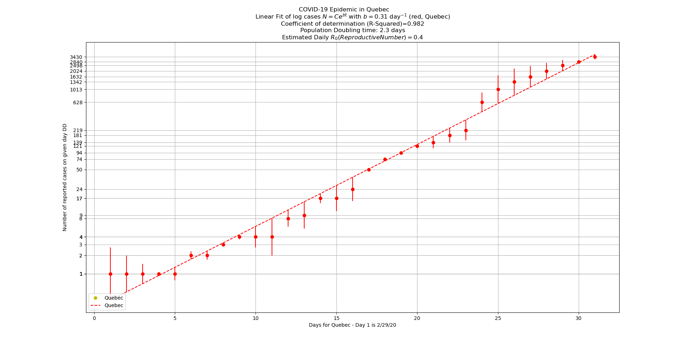
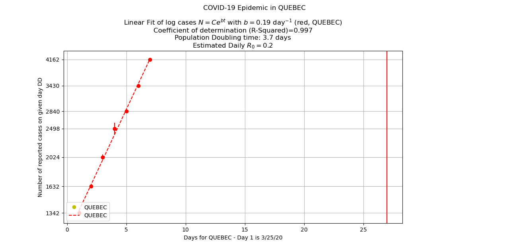

COVID-19 (Coronavirus) Plotting Tool With Start and End Dates to Analyze Curve Flattening
==========================================================================================

* This tool shows a linear fit of logarithmic COVID-19 historical data from Johns Hopkins University, with analysis of exponential growth parameters (useful for analyzing the start of the Covid-19 Pandemic in different places).

* It analyzes COVID-19 data provided by Johns Hopkins University Center for Systems Science and Engineering (https://github.com/CSSEGISandData/COVID-19). This tool runs in Python command line and it calculates exponent b value to indicate the level of flattening of the curve: N=Ce^(bt) at different time periods, daily reproductive rate, and population doubling time.  Different start and end times can be added to visualize the levels "flattening" of the Covid-19 cases at different time periods.

* This tool builds on the statistical calculations and plotting analysis of [Valeriu Predoi's Covid-19 Exponential Phase tool](https://github.com/valeriupredoi/COVID-19_LINEAR/blob/master/README.md#Introduction). 

* Example Commands:

    `python covid19_linear_plot.py --province_state Quebec --url https://raw.githubusercontent.com/CSSEGISandData/COVID-19/master/csse_covid_19_data/csse_covid_19_time_series/time_series_covid19_confirmed_global.csv --start_date Feb/29/2020 --end_date Mar/31/2020`

    Abbreviated command:

    `covid19_linear_plot.py -p Quebec -u https://raw.githubusercontent.com/CSSEGISandData/COVID-19/master/csse_covid_19_data/csse_covid_19_time_series/time_series_covid19_confirmed_global.csv -s Feb/29/2020 -e Mar/31/2020`

    For help/instructions:
    
    `python covid19_linear_plot.py -h`

* Start and End date parameters are optional.  You must enter start and end dates that fall within the date range of the time series data. See data source at 
https://github.com/CSSEGISandData/COVID-19/blob/master/csse_covid_19_data/csse_covid_19_time_series/time_series_covid19_confirmed_global.csv
Start and end dates need to be entered in the format of month/day/year or month-day-year.

* __Software Requirements:__ Python 3 (on Windows, Mac, or Linux) and Python libraries numpy, matplotlib and Pandas. 

* __Example plots of COVID-19 cases in Quebec, Canada, based on different dates__:

  __Quebec reported cases for March 1 - 24, 2020__ show exponent b value of 0.29 (higher value indicates sharper/faster exponential growth) and population doubling time of 2.4 days. Fitted line of logarithmic data and Coefficient of determination (R-Squared) are also shown.

  

  __Quebec reported cases for March 25 - 31, 2020__ show exponent b value of  0.19 (this value is lower than the March 1-24 b value so it indicates flattening curve of infection rates), and population doubling time is 3.7 days. The doubling time of infections is also longer in this time period than the March 1-24 timer period. These values show that mitigation efforts (e.g. locking down of communities, encouraging social distancing, etc.) are working to reduce exponential growth of infections.
  
  NOTE: The fitted line in this plot looks "steeper" than the March 1-24 fitted line because this plot has fewer data points. In this case, the exponent b value and population doubling time value are better indicators of curve flattening than the graphical line representation.  
  
  
