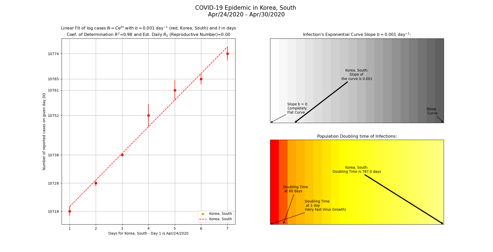

COVID-19 (Coronavirus) Plotting Tool With Start and End Dates to Analyze Curve Flattening
==========================================================================================

* This tool uses statistical analysis to create a linear fit graph of logarithmic COVID-19 (Coronavirus) data from Johns Hopkins University and analyzes exponential growth. It is useful for analyzing the Covid-19 Pandemic at the country-level or at province/state level, or at the world (global) level. 
**New World Feature (Added in July, 2020):** You can now plot the Covid-19 data for the entire world.

* Example of South Korea COVID-19 cases in late April, 2020 (very flat curve). __(Click to view Enlarged Image):__ 

* It analyzes the COVID-19 (SARS-CoV-2) time series data provided by Johns Hopkins University Center for Systems Science and Engineering (https://github.com/CSSEGISandData/COVID-19). This tool runs in Python command line and it calculates exponent b value to indicate the level of steepening or flattening of the curve (N=Ce^(bt)) at different time periods, estimated daily reproductive rate, and population doubling time.  Different start and end times can be added to visualize the steepness or flatness of the curve at different time periods.

* This tool builds on the statistical calculations and plotting analysis of [Valeriu Predoi's Covid-19 Exponential Phase tool](https://github.com/valeriupredoi/COVID-19_LINEAR/blob/master/README.md#Introduction). 

* The 2 smaller charts on the right side use color scales to show strength of the curve's steepness and the speed of COVID-19 doubling time, and are good ways to assess efforts to "flatten the curve". 

* __Example Command, to obtain plot of a province or state:__

    `python covid19_linear_plot.py --province_state Quebec --url https://raw.githubusercontent.com/CSSEGISandData/COVID-19/master/csse_covid_19_data/csse_covid_19_time_series/time_series_covid19_confirmed_global.csv --start_date Feb/29/2020 --end_date Mar/31/2020`

    __Abbreviated command:__

    `python covid19_linear_plot.py -p Quebec -u https://raw.githubusercontent.com/CSSEGISandData/COVID-19/master/csse_covid_19_data/csse_covid_19_time_series/time_series_covid19_confirmed_global.csv -s Feb/29/2020 -e Mar/31/2020`
    
    __Plot the data for a country:__
    
    `python covid19_linear_plot.py -c US -u https://raw.githubusercontent.com/CSSEGISandData/COVID-19/master/csse_covid_19_data/csse_covid_19_time_series/time_series_covid19_confirmed_global.csv -s Mar/01/2020 -e Mar/31/2020`

    __Plot the data for the entire world:__
    
    `python covid19_linear_plot.py --world -u https://raw.githubusercontent.com/CSSEGISandData/COVID-19/master/csse_covid_19_data/csse_covid_19_time_series/time_series_covid19_confirmed_global.csv -s Mar/01/2020 -e Mar/15/2020`

    __Abbreviated command to plot the data for the entire world:__
    
    `python covid19_linear_plot.py -w -u https://raw.githubusercontent.com/CSSEGISandData/COVID-19/master/csse_covid_19_data/csse_covid_19_time_series/time_series_covid19_confirmed_global.csv -s Mar/01/2020 -e Mar/15/2020`

    __For help/instructions:__
    
    `python covid19_linear_plot.py -h`

* __Example plots of COVID-19 cases in Quebec, Canada, based on different dates:__

  __Quebec reported cases for March 1 - 23, 2020__ show  b value(curve's slope value) of 0.286 (higher value indicates sharper/faster exponential growth) and population doubling time of 2.4 days. Fitted line of logarithmic data and Coefficient of determination (R-Squared) are also shown. This period also coincided with many Quebec residents [travelling on Spring Break vacations with their families and a rise in COVID-19 infections.](https://www.theglobeandmail.com/canada/article-why-quebecs-coronavirus-cases-have-skyrocketed/)

  

  __Quebec reported cases for April 24 - April 30, 2020__ show exponent b value of 0.033 (value is much lower than the March 1-23 b value so it indicates a flattening curve of infections). The population doubling time of infections of 20.9 days is much longer in this time period than in the March 1-23 time period. These values show that mitigation efforts (e.g. "stay at home" rules, and mandatory social distancing requirements, etc.) are working to reduce exponential growth of infections.
   
  

* __Country plot of COVID-19 cases in Italy for March 21, 2020 to April 5, 2020:__

  Italy experienced a peak of confirmed new Covid-19 cases [on March 21, 2020 with 6557 new cases (53578 total confirmed cases).
  ](https://github.com/CSSEGISandData/COVID-19/blob/master/csse_covid_19_data/csse_covid_19_time_series/time_series_covid19_confirmed_global.csv)  This plot shows the 2 week period starting from March 21, 2020 and indicates the curve flattening with a b value (slope value) of 0.059 and a population doubling time greater than 11 days. 
  
  

* __World Plot of COVID-19 for the end of June 2020:__

World cases continue to climb from June 20 to 30, 2020. The rate of infection increases in this time period in June 2020 shows a doubling of reported infections every 39 days.  
  
  

* Start and End date parameters are optional.  You must enter start and end dates that fall within the date range of the time series data. See data source at 
https://github.com/CSSEGISandData/COVID-19/blob/master/csse_covid_19_data/csse_covid_19_time_series/time_series_covid19_confirmed_global.csv
Start and end dates should be entered in the format of month/day/year or month-day-year. It's best to enter time periods of 7 to 10 days to obtain a good line fit, but longer time periods will also work.

* __Software Requirements:__ 

    Python 3 (on Windows, Mac, or Linux) and Python libraries numpy, matplotlib and Pandas. 
