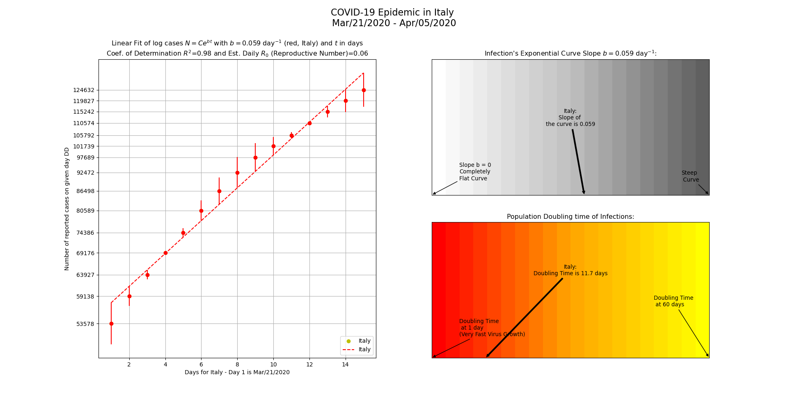

COVID-19 (Coronavirus) Plotting Tool With Start and End Dates to Analyze Curve Flattening
==========================================================================================

* This tool shows a linear fit of logarithmic COVID-19 (SARS-CoV-2) historical data from Johns Hopkins University, with analysis of exponential growth parameters. It is useful for analyzing the start of the Covid-19 Pandemic at the country-level or at province/state level.

* It analyzes the COVID-19 time series data provided by Johns Hopkins University Center for Systems Science and Engineering (https://github.com/CSSEGISandData/COVID-19). This tool runs in Python command line and it calculates exponent b value to indicate the level of flattening of the curve: N=Ce^(bt) at different time periods, daily reproductive rate, and population doubling time.  Different start and end times can be added to visualize the levels "flattening" of the Covid-19 cases at different time periods.

* This tool builds on the statistical calculations and plotting analysis of [Valeriu Predoi's Covid-19 Exponential Phase tool](https://github.com/valeriupredoi/COVID-19_LINEAR/blob/master/README.md#Introduction). 

* Example Commands:

    `python covid19_linear_plot.py --province_state Quebec --url https://raw.githubusercontent.com/CSSEGISandData/COVID-19/master/csse_covid_19_data/csse_covid_19_time_series/time_series_covid19_confirmed_global.csv --start_date Feb/29/2020 --end_date Mar/31/2020`

    Abbreviated command:

    `python covid19_linear_plot.py -p Quebec -u https://raw.githubusercontent.com/CSSEGISandData/COVID-19/master/csse_covid_19_data/csse_covid_19_time_series/time_series_covid19_confirmed_global.csv -s Feb/29/2020 -e Mar/31/2020`
    
    Plot the data for a country:
    `python covid19_linear_plot.py -c US -u https://raw.githubusercontent.com/CSSEGISandData/COVID-19/master/csse_covid_19_data/csse_covid_19_time_series/time_series_covid19_confirmed_global.csv -s Mar/01/2020 -e Mar/31/2020`

    For help/instructions:
    
    `python covid19_linear_plot.py -h`

* Start and End date parameters are optional.  You must enter start and end dates that fall within the date range of the time series data. See data source at 
https://github.com/CSSEGISandData/COVID-19/blob/master/csse_covid_19_data/csse_covid_19_time_series/time_series_covid19_confirmed_global.csv
Start and end dates need to be entered in the format of month/day/year or month-day-year.

* __Software Requirements:__ Python 3 (on Windows, Mac, or Linux) and Python libraries numpy, matplotlib and Pandas. 

* __Example plots of COVID-19 cases in Quebec, Canada, based on different dates:__

  __Quebec reported cases for March 1 - 23, 2020__ show exponent b value(slope value) of 0.29 (higher value indicates sharper/faster exponential growth) and population doubling time of 2.4 days. Fitted line of logarithmic data and Coefficient of determination (R-Squared) are also shown. This period also coincided with many Quebec residents [travelling on Spring Break vacations with their families and a rise in COVID-19 infections.](https://www.theglobeandmail.com/canada/article-why-quebecs-coronavirus-cases-have-skyrocketed/)

  

  __Quebec reported cases for March 24 - April 5, 2020__ show exponent b value of  0.16 (value is lower than the March 1-23 b value so it indicates a flattening curve of infections) and population doubling time is 4.2 days. The doubling time of infections is also longer in this time period than the March 1-23 time period. These values show that mitigation efforts (e.g. locking down of communities, "stay at home" and mandatory social distancing requirements, etc.) are working to reduce exponential growth of infections.
   
  

* __Country plot of COVID-19 cases in Italy for Mar/21/2020 to Apr/05/2020:__

  Italy experienced a peak of confirmed new Covid-19 cases [on March 21, 2020 with 6557 new cases (53578 total confirmed cases).
  ](https://github.com/CSSEGISandData/COVID-19/blob/master/csse_covid_19_data/csse_covid_19_time_series/time_series_covid19_confirmed_global.csv)  This plot shows the 2 week period starting from March 21, 2020 and indicates the curve flattening with a small b value (slope value) of 0.06 and a population doubling time of 12.1 days. 
  
  
